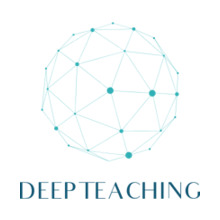

<p>
    
</p>
A crash course on the mathematics and algorithms behind Deep Learning
mechanics.

This project provides [Jupyter notebooks](http://jupyter.org/), links to
original papers and insightful blog posts, and a lightweight Python library
implementing all the basic operations and algorithms on which Artificial Neural
Networks are shaped.


## Getting started
This project is meant to be executed on either Windows or Linux (Ubuntu 16.04 or
later is preferred due to its compatibility with [TensorFlow](https://www.tensorflow.org/)),
and it is based on Python 3.

### Prerequisites
Anaconda3 is required.
If you do not have it already installed, you can get it here:
* [Windows](https://www.anaconda.com/download/#windows)
* [Linux](https://www.anaconda.com/download/#linux)

### Installing
As soon as you have Anaconda installed, you can proceed to set up the
environment.

Navigate to the downloaded `deepteaching` folder.

* On **Windows**, start the Anaconda command prompt and issue
```
$ conda env create -f deepteaching_win32.yml -n deepteaching
```

* On **Linux**, open a terminal and issue
```
$ conda env create -f deepteaching_linux.yml -n deepteaching
```

### Installing CUDA and cuDNN
Check on the official [TensorFlow installation guides](https://www.tensorflow.org/install/)
for supported versions of CUDA and cuDNN.

Verify to have a [CUDA-Enabled GPU](https://developer.nvidia.com/cuda-gpus).

If you don't, skip to the next section.
If you do, then follow the official CUDA installation guide:
* [CUDA Install - Windows](https://docs.nvidia.com/cuda/cuda-installation-guide-microsoft-windows/index.html)
* [CUDA Install - Linux](https://docs.nvidia.com/cuda/cuda-installation-guide-linux/index.html)

As soon as you have installed and tested your CUDA installation, proceed to
install the [cuDNN](https://docs.nvidia.com/deeplearning/sdk/cudnn-install/index.html)
library; this will support GPU operations for TensorFlow.

### Installing TensorFlow
Just follow carefully the official [TensorFlow installation guide](https://www.tensorflow.org/install/)
for your OS.


## Tests
First activate the enviroment:

* on **Windows**'s Anaconda command prompt
```
$ activate deepteaching
```

* on **Linux**'s `bash`
```
$ source activate deepteaching
```

To test the *notebooks*, open the first lesson
```
$ jupyter notebook Lesson_1.ipynb
```
and run all cells.

To test the provided *source code*, enter
```
$ cd src/tests
$ python test.py
$ python test_bptt.py
```


## Authors
* **Matteo Spallanzani** - [HiPeRT Lab](https://hipert.unimore.it/)


## License
This project is licensed under the BSD 2-Clause license - see the [LICENSE](LICENSE)
file for details.


## Acknowledgements
This course concept was highly inspired by [Udacity](https://eu.udacity.com/)'s
`miniflow`.
